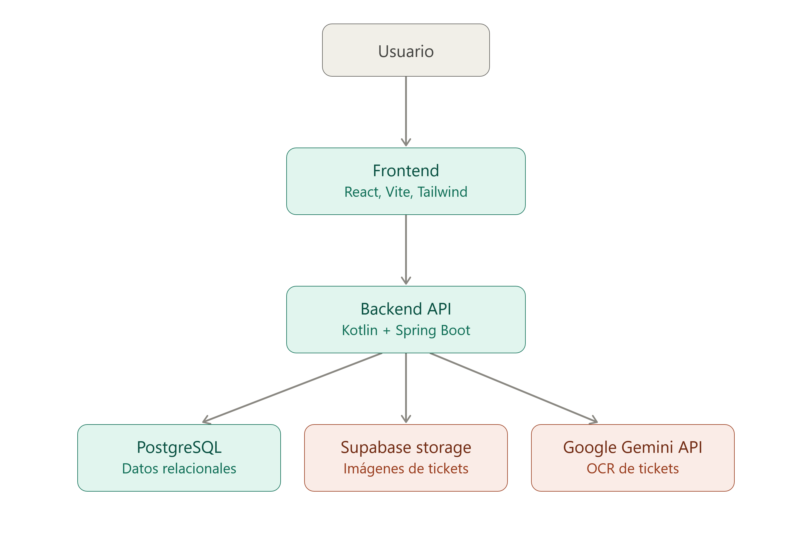
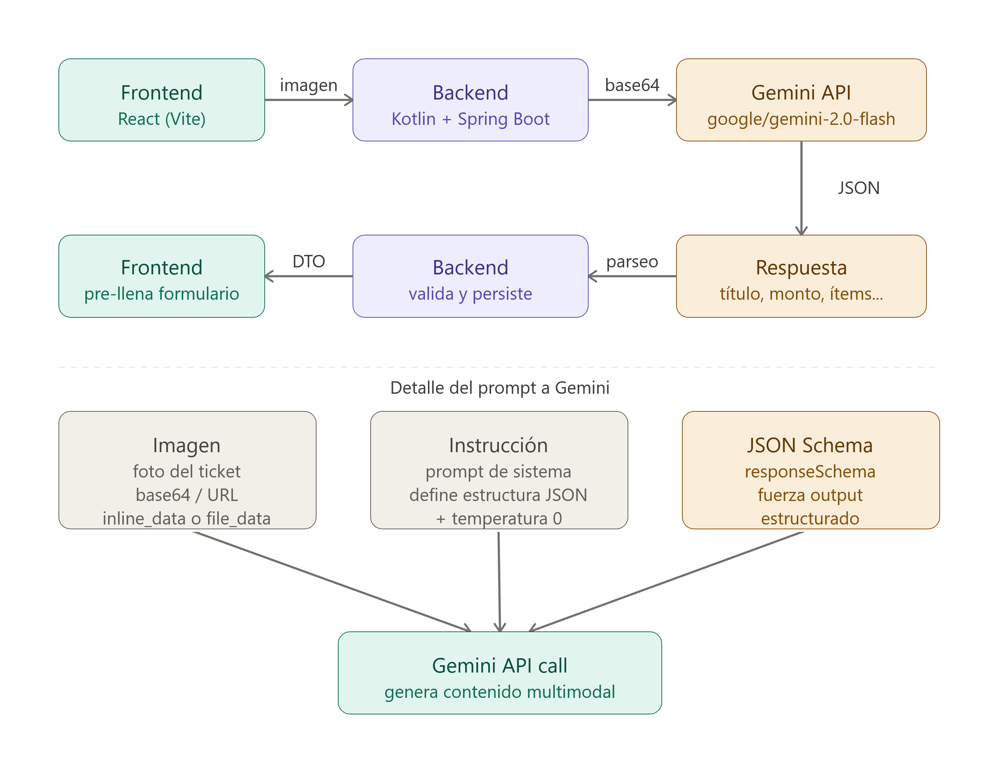
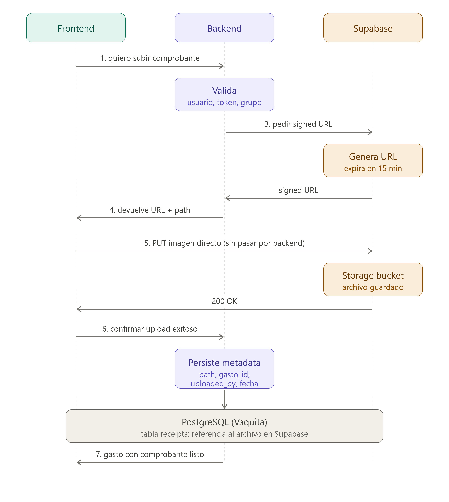
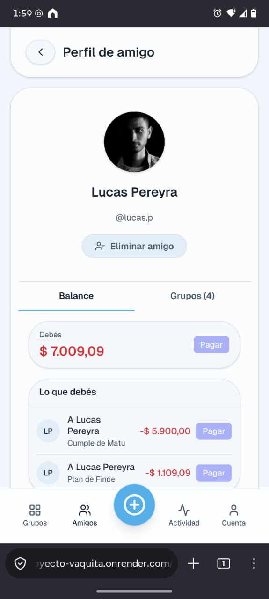
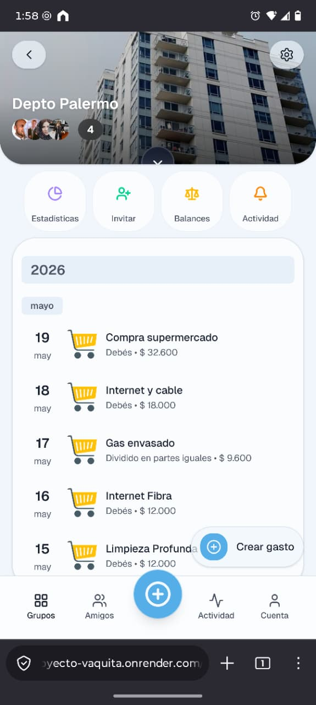
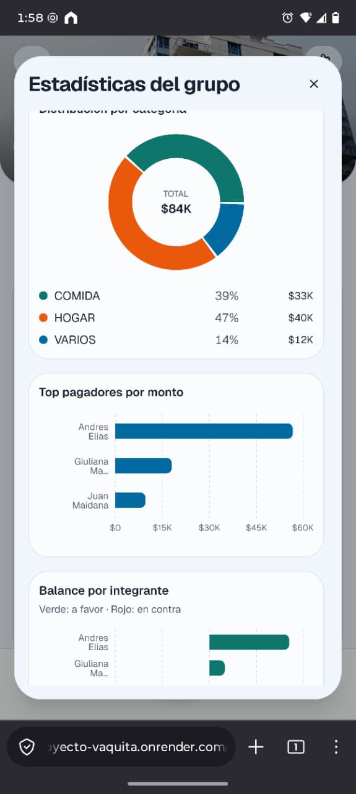

## 📌 Acerca de este repositorio

Este repositorio documenta la arquitectura, el funcionamiento y las principales decisiones técnicas del proyecto.

El código permanece privado por tratarse de un desarrollo colaborativo, por lo que este repositorio funciona como showcase del proyecto.

# 🐄 Vaquita — Gestión Compartida de Gastos con IA

> Una aplicación diseñada para eliminar la fricción de dividir gastos, aportando claridad mediante automatización, escaneo inteligente de tickets y una interfaz moderna.

Vaquita es una aplicación mobile-first para gestionar gastos compartidos entre grupos de personas. 

## ✨ Características

- 👥 Gestión de grupos y amigos.
- 💸 División de gastos mediante distintos métodos.
- 🤖 Smart Scan con IA para cargar tickets automáticamente.
- ☁️ Almacenamiento de comprobantes en la nube.
- 📊 Estadísticas del grupo.
- 🔔 Feed de actividad.
- 💱 Conversión de monedas.

## 🛠️ Stack Tecnológico

| Categoría | Tecnologías |
|-----------|-------------|
| Frontend | React · Vite · Tailwind CSS · shadcn/ui |
| Backend | Kotlin · Spring Boot |
| Base de datos | PostgreSQL |
| Storage | Supabase Storage |
| Inteligencia Artificial | Google Gemini API |
| Herramientas | Git · GitHub · Jira |

## 🎯 El Problema y la Solución

**El Problema**

La idea surgió al usar aplicaciones existentes del mismo tipo y notar varios puntos de fricción:

* UI/UX desactualizada y, en ocasiones, poco intuitiva.
* Funcionalidades básicas bloqueadas tras paywalls.
* Imposibilidad de detallar un gasto por ítems específicos.
* Falta de automatización (carga manual y tediosa de tickets largos).
* Ausencia de un registro o almacenamiento de los comprobantes originales.

**La solución: Vaquita**

Desarrollamos una alternativa enfocada en la fluidez y la automatización. Implementamos características clave como grupos, manejo de amigos, feed de actividad y conversión de monedas. Los principales diferenciales técnicos son el **Smart Scan** (integración con la API de Gemini para la lectura de tickets mediante IA) y el almacenamiento en la nube de los comprobantes asociados a cada gasto (utilizando Supabase).

## 👨‍💻 Mi contribución

Además del desarrollo de funcionalidades, asumí un rol de liderazgo técnico durante el proyecto, participando tanto en la definición de la solución como en la organización del equipo.

Entre mis principales responsabilidades estuvieron:

* Definición del alcance del MVP y priorización de funcionalidades.
* Organización del trabajo del equipo, seguimiento de tareas y coordinación del desarrollo.
* Diseño de la arquitectura inicial del frontend (estructura del proyecto, routing, organización de carpetas y configuración base).
* Diseño del contexto y prompts utilizados para la integración con Google Gemini.
* Desarrollo completo del flujo **Smart Scan**, incluyendo la integración con la API de Gemini y las validaciones asociadas.
* Diseño e implementación del flujo de almacenamiento de comprobantes mediante **presigned URLs** y Supabase Storage.
* Desarrollo de distintas vistas de la aplicación, incluyendo la gestión y detalle de grupos.
* Revisión continua de la experiencia de usuario (UI/UX), proponiendo mejoras durante el desarrollo para mantener una experiencia consistente.

Además, participé activamente en las presentaciones del proyecto y en la comunicación de las decisiones técnicas tomadas durante el desarrollo.

## 🏗️ Arquitectura del Sistema

El sistema sigue una arquitectura cliente-servidor clásica, con una separación clara de responsabilidades:

| Capa     | Tecnología                          |
| -------- | ----------------------------------- |
| Frontend | React + Vite + Tailwind + shadcn/ui |
| Backend  | Kotlin + Spring Boot                |
| Database | PostgreSQL                          |
| Storage  | Supabase                            |
| AI       | Google Gemini                       |

    

## 🧠 Decisiones técnicas

Durante el desarrollo priorizamos la velocidad de iteración y la viabilidad del MVP:

1. **Elección del stack (Kotlin/Spring Boot + React):** optamos por tecnologías con las que el equipo ya estaba familiarizado, para evitar la curva de aprendizaje y no sumar *overhead* al desarrollo.
2. **Uso de Supabase:** necesitábamos una solución robusta para almacenar los comprobantes de pago. Supabase nos ofreció el mejor servicio de BaaS (Backend as a Service) en su capa gratuita, resolviendo el problema sin tener que configurar un bucket de AWS S3 desde cero.
3. **Delegación del OCR a Gemini:** crear un motor de reconocimiento óptico de caracteres propio y entrenarlo para entender distintos formatos de tickets era inviable por tiempo y costos. Usar la API de Gemini nos permitió validar rápido que la funcionalidad "Smart Scan" aportaba valor real al MVP.

## ⚙️ Caso de Uso Principal: Smart Scan

El flujo diferencial de la aplicación resuelve la carga manual de gastos automatizando la lectura del ticket:

1. El usuario abre la app, entra a **Smart Scan** y toma o sube una foto del ticket.
2. Al confirmar el escaneo, el frontend comprime la imagen a **base64** y la envía al backend.
3. El backend reenvía la imagen a la API de Gemini junto con un **schema** que define con precisión los campos esperados — y que también encapsula reglas de negocio, como categorías válidas y monedas soportadas.
4. Gemini devuelve la información estructurada (título inferido, descripción, ítems, cantidades, precio total, fecha y moneda). El backend valida que no falten campos y que respeten las reglas de negocio antes de responder.
5. El frontend se pobla con ese JSON, permitiendo que el usuario corrija cualquier valor si el modelo se equivocó.
6. Al confirmar, se selecciona el grupo, los integrantes involucrados y el método de división (partes iguales, montos exactos, etc.). El backend impacta el gasto en PostgreSQL, actualiza los balances, notifica en el *Activity Feed* y dispara el flujo de almacenamiento del comprobante (detallado en la sección de desafíos).

> Tanto este flujo como el de almacenamiento de comprobantes incluyen autenticación, autorización y validaciones de negocio adicionales que omitimos aquí para no extender la explicación.

## 🚧 Desafíos Técnicos y Soluciones

### 1. Desafío del Escaneo Inteligente (OCR)

Construir y entrenar un motor de OCR propio para interpretar tickets con formatos heterogéneos era inviable para los tiempos del MVP. La decisión fue delegar ese trabajo a la API de Gemini, usándola como modelo de OCR.

El verdadero desafío no fue obtener texto de la imagen, sino garantizar que la respuesta de la IA fuera **siempre estructurada y confiable**. Lo resolvimos en dos capas:

* **Schema estricto:** el backend le pide a Gemini la información siguiendo un schema fijo, que además codifica reglas de negocio (categorías permitidas, monedas soportadas, formato de fecha).
* **Validación en el backend:** antes de responderle al frontend, el backend chequea que el JSON devuelto tenga todos los campos requeridos y respete esas reglas. Si algo no cierra, se lo informa al frontend en lugar de propagar datos incompletos.

Esto nos permite confiar en el escaneo la mayor parte del tiempo, y dejar siempre una instancia de corrección manual para los casos donde la IA se equivoca.

    

### 2. Desafío del Almacenamiento de Tickets

Necesitábamos guardar el comprobante original de cada gasto sin sobrecargar al backend con la transferencia de archivos. El flujo quedó así:

1. El usuario crea un gasto y decide adjuntar un comprobante (en Smart Scan se agrega por defecto, aunque puede eliminarse).
2. Si hay un comprobante, el backend le pide a la API de Supabase una **presigned URL**, válida por unos 15 minutos, y se la devuelve al frontend.
3. El frontend usa esa URL para subir la imagen **directamente a Supabase**, de forma atómica. Si la subida es exitosa, vuelve a llamar al backend.
4. El backend persiste en PostgreSQL únicamente la **metadata** del archivo (no la imagen en sí), de modo que más adelante se puede reconstruir el acceso al comprobante guardado en Supabase.

    

**Por qué dos enfoques distintos:** en el caso del OCR, el backend necesita ver la imagen para reenviarla a Gemini y validar la respuesta: si bien se puede considerar un "pasamanos", aporta valor. En el caso del almacenamiento, en cambio, el backend no necesita tocar el binario de la imagen: usar una presigned URL le permite al frontend subir el archivo directo a Supabase, evitando que el backend cargue con un trabajo de transferencia que no le corresponde y que consumiría recursos innecesariamente.

## 📱 Demostración (UI)

A continuación algunas vistas de la aplicación:

    
    
    

## 📌 Estado del proyecto

El proyecto fue desarrollado como MVP funcional y permitió validar la experiencia de uso del Smart Scan y del sistema de gestión de gastos compartidos.

Este repositorio tiene como objetivo documentar la arquitectura y las decisiones técnicas del proyecto, ya que el código fuente permanece privado por tratarse de un desarrollo colaborativo.